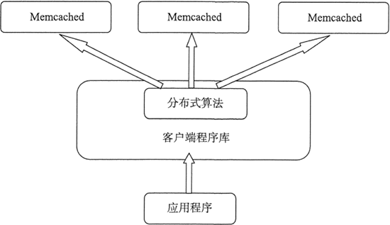

    <a href="#" onclick="refreshContent('cached')">返回目录</a>

---

# Memcached

---
Memcached 是一个分布式内存缓存系统，设计简单易用，非常适合用作缓存或会话存储。 Memcache是一套开放源代码的分布式高速缓存系统，由LiveJournal的Brad Fitzpatrick开发。
Memcache通过在内存里维护一个统一的巨大的hash表，它能够用来存储各种格式的数据，包括图像、视频、文件以及数据库检索的结果等。 简单的说就是将数据调用到内存中，然后从内存中读取，从而大大提高读取速度。

特点：

    1、协议简单：Memcached的服务器客户端通信使用简单的基于文本的协议。
    2、基于libevent的事件处理：libevent是个程序库，他将Linux 的epoll、BSD类操作系统的kqueue等时间处理功能封装成统一的接口，能在Linux、BSD、Solaris等操作系统上发挥其高性能。
    3、内置内存存储方式：Memcached的数据都存储在内置的内存存储空间中，因此重启Memcached，重启操作系统会导致全部数据消失。另外，内容容量达到指定的值之后Memcached会自动删除不适用的缓存。
    4、两阶段哈希结构：Memcached就像一个巨大的、存储了很多对的哈希表，客户端可以把数据存储在多台memcached上。查询数据时，客户端首先计算出阶段一哈希，选中一个节点；客户端将请求发送给选中的节点，
        然后memcached节点通过计算出阶段二哈希，查找真正的数据（item）并返回给客户端。从实现的角度看，Memcached是一个非阻塞的、基于事件的服务器程序。
    5、不互通信的分布式：服务器端并没有分布式功能，不会互相通信以共享信息。分布式是通过客户端实现。

使用场景：

    1、分布式应用。
        由于memcached本身基于分布式的系统，所以尤其适合大型的分布式系统。
    2、数据库和前端之间的缓存。
    3、服务器间数据共享。
        举例来讲，我们将网站的登录系统、查询系统拆分为两个应用，放在不同的服务器上，并进行集群，那这个时候用户登录后，登录信息如何从登录系统服务器同步到查询系统服务器呢？
        这时候，我们便可以使用memcached，登录系统将登录信息缓存起来，查询系统便可以获得登录信息，就像获取本地信息一样。

【不适合应用的场景】：

    1、缓存的数据量比较小。
    2、缓存的数据需要持久化。

下图所示为 Memcached 的分布式。

# Java 连接 Memcached 服务

<a href="https://www.runoob.com/memcached/java-memcached.html" target="_blank">https://www.runoob.com/memcached/java-memcached.html </a>

使用 Java 程序连接 Memcached，需要在你的 classpath 中添加 Memcached jar 包。 以下程序假定 Memcached 服务的主机为 127.0.0.1，端口为 11211。

## 连接实例

Java 连接 Memcached

    import net.spy.memcached.MemcachedClient;
    import java.net.*;

    public class MemcachedJava {
        public static void main(String[] args) {
            try{
                // 本地连接 Memcached 服务
                MemcachedClient mcc = new MemcachedClient(new InetSocketAddress("127.0.0.1", 11211));
                System.out.println("Connection to server successful.");
                
                 // 关闭连接
                 mcc.shutdown();
            }catch(Exception ex){
                System.out.println( ex.getMessage() );
            }
        }
    }

该程序中我们使用 InetSocketAddress 连接 IP 为 127.0.0.1 端口 为 11211 的 memcached 服务。

## set 操作实例

以下使用 java.util.concurrent.Future 来存储数据

    import java.net.InetSocketAddress;
    import java.util.concurrent.Future;
    
    import net.spy.memcached.MemcachedClient;
    
    public class MemcachedJava {
        public static void main(String[] args) {
        
              try{
                 // 连接本地的 Memcached 服务
                 MemcachedClient mcc = new MemcachedClient(new InetSocketAddress("127.0.0.1", 11211));
                 System.out.println("Connection to server successful.");
              
                 // 存储数据
                 Future fo = mcc.set("runoob", 900, "Free Education");
              
                 // 查看存储状态
                 System.out.println("set status:" + fo.get());
                 
                 // 输出值
                 System.out.println("runoob value in cache - " + mcc.get("runoob"));
         
                 // 关闭连接
                 mcc.shutdown();
                 
              }catch(Exception ex){
                 System.out.println( ex.getMessage() );
              }
        }
    }

## add 操作实例

    import java.net.InetSocketAddress;
    import java.util.concurrent.Future;
    
    import net.spy.memcached.MemcachedClient;
    
    public class MemcachedJava {
        public static void main(String[] args) {
        
              try{
           
                 // 连接本地的 Memcached 服务
                 MemcachedClient mcc = new MemcachedClient(new InetSocketAddress("127.0.0.1", 11211));
                 System.out.println("Connection to server successful.");
         
                 // 添加数据
                 Future fo = mcc.set("runoob", 900, "Free Education");
         
                 // 打印状态
                 System.out.println("set status:" + fo.get());
         
                 // 输出
                 System.out.println("runoob value in cache - " + mcc.get("runoob"));
         
                 // 添加
                 fo = mcc.add("runoob", 900, "memcached");
         
                 // 打印状态
                 System.out.println("add status:" + fo.get());
         
                 // 添加新key
                 fo = mcc.add("runoob", 900, "All Free Compilers");
         
                 // 打印状态
                 System.out.println("add status:" + fo.get());
                 
                 // 输出
                 System.out.println("runoob value in cache - " + mcc.get("runoob"));
         
                 // 关闭连接
                 mcc.shutdown();
                 
              }catch(Exception ex){
                 System.out.println(ex.getMessage());
              }
        }
    }

## replace 操作实例

import java.net.InetSocketAddress; import java.util.concurrent.Future;

import net.spy.memcached.MemcachedClient;

public class MemcachedJava { public static void main(String[] args) {

      try {
         //连接本地的 Memcached 服务
         MemcachedClient mcc = new MemcachedClient(new InetSocketAddress("127.0.0.1", 11211));
         System.out.println("Connection to server successful.");
 
         // 添加第一个 key=》value 对
         Future fo = mcc.set("runoob", 900, "Free Education");
 
         // 输出执行 add 方法后的状态
         System.out.println("add status:" + fo.get());
 
         // 获取键对应的值
         System.out.println("runoob value in cache - " + mcc.get("runoob"));
 
         // 添加新的 key
         fo = mcc.replace("runoob", 900, "Largest Tutorials' Library");
 
         // 输出执行 set 方法后的状态
         System.out.println("replace status:" + fo.get());
 
         // 获取键对应的值
         System.out.println("runoob value in cache - " + mcc.get("runoob"));
 
         // 关闭连接
         mcc.shutdown();
         
      }catch(Exception ex){
         System.out.println( ex.getMessage() );
      }

} }

## append 操作实例

    import java.net.InetSocketAddress;
    import java.util.concurrent.Future;
    
    import net.spy.memcached.MemcachedClient;
    
    public class MemcachedJava {
        public static void main(String[] args) {
        
              try{
           
                 // 连接本地的 Memcached 服务
                 MemcachedClient mcc = new MemcachedClient(new InetSocketAddress("127.0.0.1", 11211));
                 System.out.println("Connection to server successful.");
         
                 // 添加数据
                 Future fo = mcc.set("runoob", 900, "Free Education");
         
                 // 输出执行 set 方法后的状态
                 System.out.println("set status:" + fo.get());
         
                 // 获取键对应的值
                 System.out.println("runoob value in cache - " + mcc.get("runoob"));
         
                 // 对存在的key进行数据添加操作
                 fo = mcc.append("runoob", 900, " for All");
         
                 // 输出执行 set 方法后的状态
                 System.out.println("append status:" + fo.get());
                 
                 // 获取键对应的值
                 System.out.println("runoob value in cache - " + mcc.get("runoob"));
         
                 // 关闭连接
                 mcc.shutdown();
                 
              }catch(Exception ex) {
                 System.out.println(ex.getMessage());
              ]
        }
    }

## prepend 操作实例

    import java.net.InetSocketAddress;
    import java.util.concurrent.Future;
    
    import net.spy.memcached.MemcachedClient;
    
    public class MemcachedJava {
        public static void main(String[] args) {
        
              try{
           
                 // 连接本地的 Memcached 服务
                 MemcachedClient mcc = new MemcachedClient(new InetSocketAddress("127.0.0.1", 11211));
                 System.out.println("Connection to server successful.");
         
                 // 添加数据
                 Future fo = mcc.set("runoob", 900, "Education for All");
         
                 // 输出执行 set 方法后的状态
                 System.out.println("set status:" + fo.get());
         
                 // 获取键对应的值
                 System.out.println("runoob value in cache - " + mcc.get("runoob"));
         
                 // 对存在的key进行数据添加操作
                 fo = mcc.prepend("runoob", 900, "Free ");
         
                 // 输出执行 set 方法后的状态
                 System.out.println("prepend status:" + fo.get());
                 
                 // 获取键对应的值
                 System.out.println("runoob value in cache - " + mcc.get("runoob"));
         
                 // 关闭连接
                 mcc.shutdown();
                 
              }catch(Exception ex) {
                 System.out.println(ex.getMessage());
              }
        }
    }

## CAS 操作实例

    import java.net.InetSocketAddress;
    import java.util.concurrent.Future;
    
    import net.spy.memcached.CASValue;
    import net.spy.memcached.CASResponse;
    import net.spy.memcached.MemcachedClient;
    
    public class MemcachedJava {
        public static void main(String[] args) {
        
              try{
           
                 // 连接本地的 Memcached 服务
                 MemcachedClient mcc = new MemcachedClient(new InetSocketAddress("127.0.0.1", 11211));
                 System.out.println("Connection to server successful.");
         
                 // 添加数据
                 Future fo = mcc.set("runoob", 900, "Free Education");
         
                 // 输出执行 set 方法后的状态
                 System.out.println("set status:" + fo.get());
                    
                 // 使用 get 方法获取数据
                 System.out.println("runoob value in cache - " + mcc.get("runoob"));
         
                 // 通过 gets 方法获取 CAS token（令牌）
                 CASValue casValue = mcc.gets("runoob");
         
                 // 输出 CAS token（令牌） 值
                 System.out.println("CAS token - " + casValue);
         
                 // 尝试使用cas方法来更新数据
                 CASResponse casresp = mcc.cas("runoob", casValue.getCas(), 900, "Largest Tutorials-Library");
                 
                 // 输出 CAS 响应信息
                 System.out.println("CAS Response - " + casresp);
         
                 // 输出值
                 System.out.println("runoob value in cache - " + mcc.get("runoob"));
         
                 // 关闭连接
                 mcc.shutdown();
                 
              }catch(Exception ex) {
                 System.out.println(ex.getMessage());
              }
        }
    }

## get 操作实例

    import java.net.InetSocketAddress;
    import java.util.concurrent.Future;
    
    import net.spy.memcached.MemcachedClient;
    
    public class MemcachedJava {
        public static void main(String[] args) {
        
              try{
           
                 // 连接本地的 Memcached 服务
                 MemcachedClient mcc = new MemcachedClient(new InetSocketAddress("127.0.0.1", 11211));
                 System.out.println("Connection to server successful.");
         
                 // 添加数据
                 Future fo = mcc.set("runoob", 900, "Free Education");
         
                 // 输出执行 set 方法后的状态
                 System.out.println("set status:" + fo.get());
         
                 // 使用 get 方法获取数据
                 System.out.println("runoob value in cache - " + mcc.get("runoob"));
         
                 // 关闭连接
                 mcc.shutdown();
                 
              }catch(Exception ex) {
                 System.out.println(ex.getMessage());
              }
        }
    }

## gets 操作实例、CAS

    import java.net.InetSocketAddress;
    import java.util.concurrent.Future;
    
    import net.spy.memcached.CASValue;
    import net.spy.memcached.CASResponse;
    import net.spy.memcached.MemcachedClient;
    
    public class MemcachedJava {
        public static void main(String[] args) {
        
              try{
           
                 // 连接本地的 Memcached 服务
                 MemcachedClient mcc = new MemcachedClient(new InetSocketAddress("127.0.0.1", 11211));
                 System.out.println("Connection to server successful.");
         
                 // 添加数据
                 Future fo = mcc.set("runoob", 900, "Free Education");
         
                 // 输出执行 set 方法后的状态
                 System.out.println("set status:" + fo.get());
                    
                 // 从缓存中获取键为 runoob 的值
                 System.out.println("runoob value in cache - " + mcc.get("runoob"));
         
                 // 通过 gets 方法获取 CAS token（令牌）
                 CASValue casValue = mcc.gets("runoob");
         
                 // 输出 CAS token（令牌） 值
                 System.out.println("CAS value in cache - " + casValue);
         
                 // 关闭连接
                 mcc.shutdown();
                 
              }catch(Exception ex) {
                 System.out.println(ex.getMessage());
              }
        }
    }

## delete 操作实例

    import java.net.InetSocketAddress;
    import java.util.concurrent.Future;
    
    import net.spy.memcached.MemcachedClient;
    
    public class MemcachedJava {
        public static void main(String[] args) {
        
              try{
           
                 // 连接本地的 Memcached 服务
                 MemcachedClient mcc = new MemcachedClient(new InetSocketAddress("127.0.0.1", 11211));
                 System.out.println("Connection to server successful.");
         
                 // 添加数据
                 Future fo = mcc.set("runoob", 900, "World's largest online tutorials library");
         
                 // 输出执行 set 方法后的状态
                 System.out.println("set status:" + fo.get());
         
                 // 获取键对应的值
                 System.out.println("runoob value in cache - " + mcc.get("runoob"));
         
                 // 对存在的key进行数据添加操作
                fo = mcc.delete("runoob");
         
                 // 输出执行 delete 方法后的状态
                 System.out.println("delete status:" + fo.get());
         
                 // 获取键对应的值
                 System.out.println("runoob value in cache - " + mcc.get("runoob"));
         
                 // 关闭连接
                 mcc.shutdown();
                 
              }catch(Exception ex) {
                 System.out.println(ex.getMessage());
              }
        }
    }

## Incr/Decr 操作实例

    import java.net.InetSocketAddress;
    import java.util.concurrent.Future;
    
    import net.spy.memcached.MemcachedClient;
    
    public class MemcachedJava {
        public static void main(String[] args) {
        
              try{
           
                 // 连接本地的 Memcached 服务
                 MemcachedClient mcc = new MemcachedClient(new InetSocketAddress("127.0.0.1", 11211));
                 System.out.println("Connection to server successful.");
         
                 // 添加数字值
                 Future fo = mcc.set("number", 900, "1000");
         
                 // 输出执行 set 方法后的状态
                 System.out.println("set status:" + fo.get());
         
                 // 获取键对应的值
                 System.out.println("value in cache - " + mcc.get("number"));
         
                 // 自增并输出
                 System.out.println("value in cache after increment - " + mcc.incr("number", 111));
         
                 // 自减并输出
                 System.out.println("value in cache after decrement - " + mcc.decr("number", 112));
         
                 // 关闭连接
                 mcc.shutdown();
                 
              }catch(Exception ex) {
                 System.out.println(ex.getMessage());
              }
        }
    }