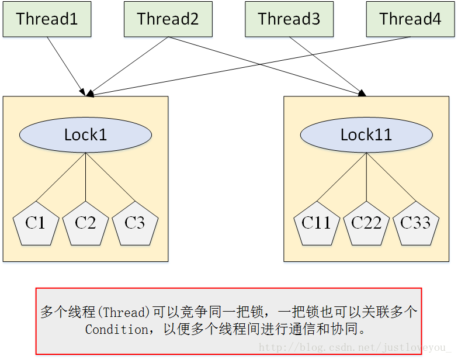

    <a href="#" onclick="refreshContent('multithread')">返回目录</a>

---

# 线程间通信

## 概述

线程与线程之间不是相互独立的个体，它们彼此之间需要相互通信和协作，最典型的例子就是生产者-消费者问题：当队列满时，生产者需要等待队列有空间才能继续往里面放入商品，而在等待的期间内，生产者必须释放对临界资源（即队列）的占用权。因为生产者如果不释放对临界资源的占用权，那么消费者就无法消费队列中的商品，就不会让队列有空间，那么生产者就会一直无限等待下去。因此一般情况下，当队列满时，会让生产者交出对临界资源的占用权，并进入挂起状态。然后等待消费者消费了商品，然后消费者通知生产者队列有空间了。同样地，当队列空时，消费者也必须等待，等待生产者通知它队列中有商品了。这种互相通信的过程就是线程间的协作。

分布式系统中说的通信机制：

    共享内存机制      消息通信机制         管道流

共享内存：线程之间共享程序的公共状态，线程之间通过读-写内存中的公共状态来隐式通信。

    volatile共享内存

消息传递：线程之间没有公共的状态，线程之间必须通过明确的发送信息来显示的进行通信。

    wait/notify等待通知方式
    join方式

管道流

    管道输入/输出流的形式

### 常用的通信方式：

管道( pipe )：

    管道是一种半双工的通信方式，数据只能单向流动，而且只能在具有亲缘关系的进程间使用。进程的亲缘关系通常是指父子进程关系。

有名管道 (named pipe) ：

    有名管道也是半双工的通信方式，但是它允许无亲缘关系进程间的通信。

信号量( semophore ) ：

    信号量是一个计数器，可以用来控制多个进程对共享资源的访问。不是用于交换大批数据,而用于多线程之间的同步.常作为一种锁机制,防止某进程在访问资源时其它进程也访问该资源。
    因此，主要作为进程间以及同一进程内不同线程之间的同步手段。

消息队列( message queue ) ：

    消息队列是由消息的链表，存放在内核中并由消息队列标识符标识。消息队列克服了信号传递信息少、管道只能承载无格式字节流以及缓冲区大小受限等缺点。

信号 ( signal ) ：

    信号是一种比较复杂的通信方式，用于通知接收进程某个事件已经发生。

共享内存( shared memory ) ：

    共享内存就是映射一段能被其他进程所访问的内存，这段共享内存由一个进程创建，但多个进程都可以访问。
    共享内存是最快的 IPC 方式，它是针对其他进程间通信方式运行效率低而专门设计的。
    它往往与其他通信机制，如信号两，配合使用，来实现进程间的同步和通信。

套接字( socket ) ：

    套解口也是一种进程间通信机制，与其他通信机制不同的是，它可用于不同机器间的进程通信。

## 一、同步

这里讲的同步是指多个线程通过synchronized关键字这种方式来实现线程间的通信。由于线程A和线程B持有同一个MyObject类的对象object，尽管这两个线程需要调用不同的方法，但是它们是同步执行的，

比如：线程B需要等待线程A执行完了methodA()方法之后，它才能执行methodB()方法。这样，线程A和线程B就实现了 通信。

这种方式，本质上就是“共享内存”式的通信。多个线程需要访问同一个共享变量，谁拿到了锁（获得了访问权限），谁就可以执行。

    public class MyObject {
        synchronized public void methodA() {
            //do something....
        }    
        synchronized public void methodB() {
            //do some other thing
        }
    }
    
    public class ThreadA extends Thread {    
        private MyObject object;
        //省略构造方法
        @Override
        public void run() {
            super.run();
            object.methodA();
        }
    }
    
    public class ThreadB extends Thread {    
        private MyObject object;
        //省略构造方法
        @Override
        public void run() {
            super.run();
            object.methodB();
        }
    }
    
    public class Run {
        public static void main(String[] args) {
            MyObject object = new MyObject();    
            //线程A与线程B 持有的是同一个对象:object
            ThreadA a = new ThreadA(object);
            ThreadB b = new ThreadB(object);
            a.start();
            b.start();
        }
    }

由于线程A和线程B持有同一个MyObject类的对象object，尽管这两个线程需要调用不同的方法，但是它们是同步执行的， 比如：线程B需要等待线程A执行完了methodA()方法之后，它才能执行methodB()
方法。这样，线程A和线程B就实现了 通信。

这种方式，本质上就是“共享内存”式的通信。多个线程需要访问同一个共享变量，谁拿到了锁（获得了访问权限），谁就可以执行。

## 二、wait/notify 机制

线程A要等待某个条件满足时(list.size()==5)，才执行操作。线程B则向list中添加元素，改变list 的size。

A,B之间如何通信的呢？也就是说，线程A如何知道 list.size() 已经为5了呢？

这里用到了Object类的 wait() 和 notify() 方法。

当条件未满足时(list.size() !=5)，线程A调用wait() 放弃CPU，并进入阻塞状态。---不像②while轮询那样占用CPU

当条件满足时，线程B调用 notify()通知 线程A，所谓通知线程A，就是唤醒线程A，并让它进入可运行状态。

这种方式的一个好处就是CPU的利用率提高了。

但是也有一些缺点：

    比如，线程B先执行，一下子添加了5个元素并调用了notify()发送了通知，而此时线程A还执行；
    当线程A执行并调用wait()时，那它永远就不可能被唤醒了。因为，线程B已经发了通知了，以后不再发通知了。这说明：通知过早，会打乱程序的执行逻辑。

wait()——让当前线程 (Thread.concurrentThread() 方法所返回的线程) 释放对象锁并进入等待（阻塞）状态

notify()——唤醒一个正在等待相应对象锁的线程，使其进入就绪队列，以便在当前线程释放锁后竞争锁，进而得到CPU的执行

notifyAll()——唤醒所有正在等待相应对象锁的线程，使它们进入就绪队列，以便在当前线程释放锁后竞争锁，进而得到CPU的执行。

demo:

                            import java.util.ArrayList;
                            import java.util.List;
                            
                            public class MyList {
                                private static List<String> list = new ArrayList<String>();
                                public static void add() {
                                    list.add("anyString");
                                }
                                public static int size() {
                                    return list.size();
                                }
                            }                           
                            
                            public class ThreadA extends Thread {
                                private Object lock;
                                public ThreadA(Object lock) {
                                    super();
                                    this.lock = lock;
                                }
                            
                                @Override
                                public void run() {
                                    try {
                                        synchronized (lock) {
                                            if (MyList.size() != 5) {
                                                System.out.println("wait begin "
                                                        + System.currentTimeMillis());
                                                lock.wait();
                                                System.out.println("wait end  "
                                                        + System.currentTimeMillis());
                                            }
                                        }
                                    } catch (InterruptedException e) {
                                        e.printStackTrace();
                                    }
                                }
                            }                            
                            
                            public class ThreadB extends Thread {
                                private Object lock;
                                
                                public ThreadB(Object lock) {
                                    super();
                                    this.lock = lock;
                                }
                            
                                @Override
                                public void run() {
                                    try {
                                        synchronized (lock) {
                                            for (int i = 0; i < 10; i++) {
                                                MyList.add();
                                                if (MyList.size() == 5) {
                                                    lock.notify();
                                                    System.out.println("已经发出了通知");
                                                }
                                                System.out.println("添加了" + (i + 1) + "个元素!");
                                                Thread.sleep(1000);
                                            }
                                        }
                                    } catch (InterruptedException e) {
                                        e.printStackTrace();
                                    }
                                }
                            }
                            
                            public class Run {
                                public static void main(String[] args) {
                                    try {
                                        Object lock = new Object();                            
                                        ThreadA a = new ThreadA(lock);
                                        a.start();                            
                                        Thread.sleep(50);
                                        ThreadB b = new ThreadB(lock);
                                        b.start();
                                    } catch (InterruptedException e) {
                                        e.printStackTrace();
                                    }
                                }
                            }

## 三、Condition

Condition是在java 1.5中出现的，它用来替代传统的Object的wait()/notify()实现线程间的协作，它的使用依赖于 Lock，Condition、Lock 和 Thread
三者之间的关系如下图所示。相比使用Object的wait()/notify()，使用Condition的await()/signal()这种方式能够更加安全和高效地实现线程间协作。Condition是个接口，基本的方法就是await()
和signal()方法。Condition依赖于Lock接口，生成一个Condition的基本代码是lock.newCondition() 。 必须要注意的是，Condition 的 await()/signal()
使用都必须在lock保护之内，也就是说，必须在lock.lock()和lock.unlock之间才可以使用。事实上，Conditon的await()/signal() 与 Object的wait()-notify()
有着天然的对应关系：Conditon中的await()对应Object的wait()；Condition中的signal()对应Object的notify()；Condition中的signalAll()
对应Object的notifyAll()。

使用Condition往往比使用传统的通知等待机制(Object的wait()/notify())要更灵活、高效，例如，我们可以使用多个Condition实现通知部分线程：

demo：

    // 线程 A
    class ThreadA extends Thread {
        private MyService service;
        public ThreadA(MyService service) {
            super();
            this.service = service;
        }
        @Override
        public void run() {
            service.awaitA();
        }
    }
    // 线程 B
    class ThreadB extends Thread {
        public ThreadB(MyService service) {
            super();
            this.service = service;
        }
        @Override
        public void run() {
            service.awaitB();
        }
    }

    class MyService {
        private Lock lock = new ReentrantLock();
        // 使用多个Condition实现通知部分线程
        public Condition conditionA = lock.newCondition();
        public Condition conditionB = lock.newCondition();
        
        public void awaitA() {
            lock.lock();
            try {
                System.out.println("begin awaitA时间为" + System.currentTimeMillis()
                        + " ThreadName=" + Thread.currentThread().getName());
                conditionA.await();
                System.out.println("  end awaitA时间为" + System.currentTimeMillis()
                        + " ThreadName=" + Thread.currentThread().getName());
            } catch (InterruptedException e) {
                e.printStackTrace();
            } finally {
                lock.unlock();
            }
        }
         
        public void awaitB() {
            lock.lock();
            try {
                System.out.println("begin awaitB时间为" + System.currentTimeMillis()
                        + " ThreadName=" + Thread.currentThread().getName());
                conditionB.await();
                System.out.println("  end awaitB时间为" + System.currentTimeMillis()
                        + " ThreadName=" + Thread.currentThread().getName());
            } catch (InterruptedException e) {
                e.printStackTrace();
            } finally {
                lock.unlock();
            }
        }
         
        public void signalAll_A() {
            try {
                lock.lock();
                System.out.println("  signalAll_A时间为" + System.currentTimeMillis()
                        + " ThreadName=" + Thread.currentThread().getName());
                conditionA.signalAll();
            } finally {
                lock.unlock();
            }
        }
         
        public void signalAll_B() {
            try {
                lock.lock();
                System.out.println("  signalAll_B时间为" + System.currentTimeMillis()
                        + " ThreadName=" + Thread.currentThread().getName());
                conditionB.signalAll();
            } finally {
                lock.unlock();
            }
        }
    }

    // 测试
    public class Run {
    public static void main(String[] args) throws InterruptedException {
    MyService service = new MyService();
    
            ThreadA a = new ThreadA(service);
            a.setName("A");
            a.start();
     
            ThreadB b = new ThreadB(service);
            b.setName("B");
            b.start();
     
            Thread.sleep(3000);
            service.signalAll_A();
        }
    }

可以看到只有线程A被唤醒，线程B仍然阻塞。实际上，Condition 实现了一种分组机制，将所有对临界资源进行访问的线程进行分组，以便实现线程间更精细化的协作，例如通知部分线程。

我们可以从上面例子的输出结果看出，只有conditionA范围内的线程A被唤醒，而conditionB范围内的线程B仍然阻塞。

## 四、生产者/消费者模式

等待/通知机制 最经典的应用就是 生产者-消费者模型。 下面以多生产者-多消费者问题为背景，分别运用两种模式 —— synchronized+wait-notify模式和Lock+Condition模式实现 wait-notify 机制。

对于生产者-消费者问题，有两个要点需要注意：

    第一，在多个同类型线程（多个生产者线程或者消费者线程）的场景中，为防止wait的条件发生变化而导致线程异常终止，我们在阻塞线程被唤醒的同时还必须对wait的条件进行额外的检查，即 使用 while 循环代替 if 条件；
    第二，在多个同类型线程（多个生产者线程或者消费者线程）的场景中，为防止生产者(消费者)唤醒生产者(消费者)，保证生产者和消费者互相唤醒，需要 使用 notify 替代 notifyAll。

## 五、线程间的通信——管道

## 六、方法Join的使用

在很多应用场景中存在这样一种情况，主线程创建并启动子线程后，如果子线程要进行很耗时的计算，那么主线程将比子线程先结束，但是主线程需要子线程的计算的结果来进行自己下一步的计算，这时主线程就需要等待子线程，java中提供可join()
方法解决这个问题。

join()方法的作用是：在当前线程A调用线程B的join()方法后，会让当前线程A阻塞，直到线程B的逻辑执行完成，A线程才会解除阻塞，然后继续执行自己的业务逻辑，这样做可以节省计算机中资源。

    public class TestJoin {
        public static void main(String[] args){
            Thread thread=new Thread(new Runnable() {
                @Override
                public void run() {
                    System.out.println("线程0开始执行了");
                }
            });
            thread.start();
            for (int i=0;i<10;i++){
                JoinThread jt=new JoinThread(thread,i);
                jt.start();
                thread=jt;
            }
        
        }
    
        static class JoinThread extends Thread{
            private Thread thread;
            private int i;
            
            public JoinThread(Thread thread,int i){
                this.thread=thread;
                this.i=i;
            }
        
            @Override
            public void run() {
                try {
                    thread.join();
                    System.out.println("线程"+(i+1)+"执行了");
                } catch (InterruptedException e) {
                    e.printStackTrace();
                }
            }
        }
    }

## 七、while轮询的方式

在这种方式下，线程A不断地改变条件，线程ThreadB不停地通过while语句检测这个条件(list.size()==5)是否成立 ，从而实现了线程间的通信。但是这种方式会浪费CPU资源。
之所以说它浪费资源，是因为JVM调度器将CPU交给线程B执行时，它没做啥“有用”的工作，只是在不断地测试 某个条件是否成立。 就类似于现实生活中，某个人一直看着手机屏幕是否有电话来了，而不是：
在干别的事情，当有电话来时，响铃通知TA电话来了。关于线程的轮询的影响，可参考：<a href="https://www.cnblogs.com/hapjin/p/5467984.html" target="_blank">
JAVA多线程之当一个线程在执行死循环时会影响另外一个线程吗？ </a>

这种方式还存在另外一个问题：

轮询的条件的可见性问题，关于内存可见性问题，可参考：<a href="https://www.cnblogs.com/hapjin/p/5492880.html" target="_blank">JAVA多线程之volatile 与
synchronized 的比较</a>中的第一点“一，volatile关键字的可见性”

线程都是先把变量读取到本地线程栈空间，然后再去再去修改的本地变量。因此，如果线程B每次都在取本地的 条件变量，那么尽管另外一个线程已经改变了轮询的条件，它也察觉不到，这样也会造成死循环。

demo：

                    import java.util.ArrayList;
                    import java.util.List;
                    
                    public class MyList {
                    
                        private List<String> list = new ArrayList<String>();
                        public void add() {
                            list.add("elements");
                        }
                        public int size() {
                            return list.size();
                        }
                    }
                    
                    import mylist.MyList;
                    
                    public class ThreadA extends Thread {
                    
                        private MyList list;
                    
                        public ThreadA(MyList list) {
                            super();
                            this.list = list;
                        }
                    
                        @Override
                        public void run() {
                            try {
                                for (int i = 0; i < 10; i++) {
                                    list.add();
                                    System.out.println("添加了" + (i + 1) + "个元素");
                                    Thread.sleep(1000);
                                }
                            } catch (InterruptedException e) {
                                e.printStackTrace();
                            }
                        }
                    }
                    
                    import mylist.MyList;
                    
                    public class ThreadB extends Thread {
                    
                        private MyList list;
                    
                        public ThreadB(MyList list) {
                            super();
                            this.list = list;
                        }
                    
                        @Override
                        public void run() {
                            try {
                                while (true) {
                                    if (list.size() == 5) {
                                        System.out.println("==5, 线程b准备退出了");
                                        throw new InterruptedException();
                                    }
                                }
                            } catch (InterruptedException e) {
                                e.printStackTrace();
                            }
                        }
                    }
                    
                    import mylist.MyList;
                    import extthread.ThreadA;
                    import extthread.ThreadB;
                    
                    public class Test {
                    
                        public static void main(String[] args) {
                            MyList service = new MyList();
                    
                            ThreadA a = new ThreadA(service);
                            a.setName("A");
                            a.start();
                    
                            ThreadB b = new ThreadB(service);
                            b.setName("B");
                            b.start();
                        }
                    }

# 参考

<a href="https://www.cnblogs.com/hapjin/p/5492619.html" target="_blank">JAVA多线程之线程间的通信方式 </a>
<a href="https://zhuanlan.zhihu.com/p/138689342" target="_blank">拜托，线程间的通信真的很简单 </a>

<a href="https://blog.csdn.net/weixin_46217160/article/details/108743389" target="_blank">线程间的通信方式 </a>
<a href="https://blog.csdn.net/u011635492/article/details/83043212" target="_blank">JAVA线程通信详解 </a>