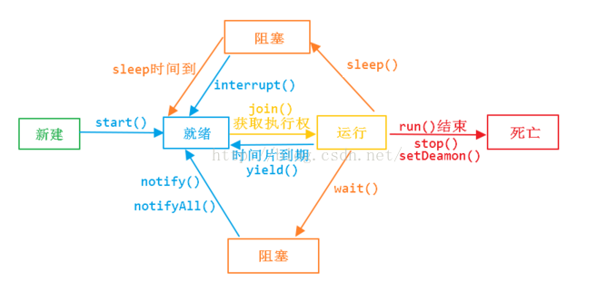

    <a href="#" onclick="refreshContent('multithread')">返回目录</a>

---

# 线程池 的使用

---

## 线程池的优点？

    1）重用存在的线程，减少对象创建销毁的开销。

    2）可有效的控制最大并发线程数，提高系统资源的使用率，同时避免过多资源竞争，避免堵塞。

    3）提供定时执行、定期执行、单线程、并发数控制等功能。

## 使用线程池的好处？

    降低资源消耗。通过重复利用已创建的线程，降低线程创建和销毁造成的消耗。
    提高响应速度。当任务到达时，任务可以不需要等到线程创建就能立即执行。
    提高线程的可管理性。线程是稀缺资源，如果无限制地创建，不仅会消耗系统资源，还会降低系统的稳定性，使用线程池可以进行统一分配、调优和监控

## 不使用线程池有哪些坏处。

    频繁的线程创建和销毁会占用更多的CPU和内存
    频繁的线程创建和销毁会对GC产生比较大的压力
    线程太多，线程切换带来的开销将不可忽视
    线程太少，多核CPU得不到充分利用，是一种浪费

## Java通过Executors提供四种线程池，分别为：

    newCachedThreadPool创建一个可缓存线程池，如果线程池长度超过处理需要，可灵活回收空闲线程，若无可回收，则新建线程。

    newFixedThreadPool 创建一个定长线程池，可控制线程最大并发数，超出的线程会在队列中等待。

    newScheduledThreadPool 创建一个定长线程池，支持定时及周期性任务执行。

    newSingleThreadExecutor 创建一个单线程化的线程池，它只会用唯一的工作线程来执行任务，保证所有任务按照指定顺序(FIFO, LIFO, 优先级)执行。

## 为什么要使用线程池？

    我们知道不用线程池的话，每个线程都要通过 new Thread(xxRunnable).start()的方 式来创建并运行一个线程，线程少的话这不会是问题。

    而真实环境可能会开启多个线程让系统和程序达到最佳效率，当线程数达到一定数量就会耗尽系统的 CPU 和 内存资源，也会造成 GC频繁收集和停顿，因为每次创建和销毁一个线程都是要消 耗系统资源的。

    如果为每个任务都创建线程这无疑是一个很大的性能瓶颈。所以， 线程池中的线程复用极大节省了系统资源，当线程一段时间不再有任务处理时它也 会自动销毁，而不会长驻内存

---

# 连接池 的使用

