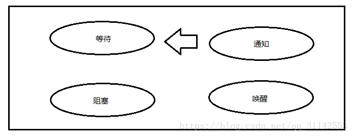
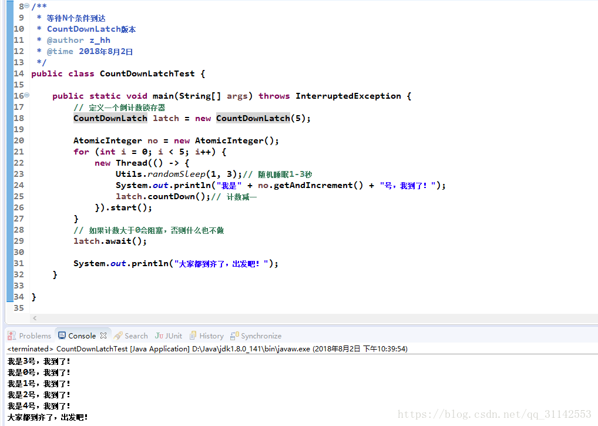
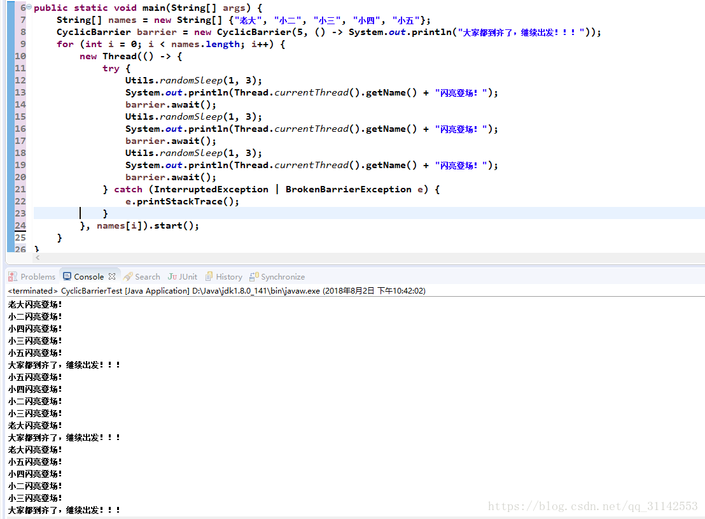
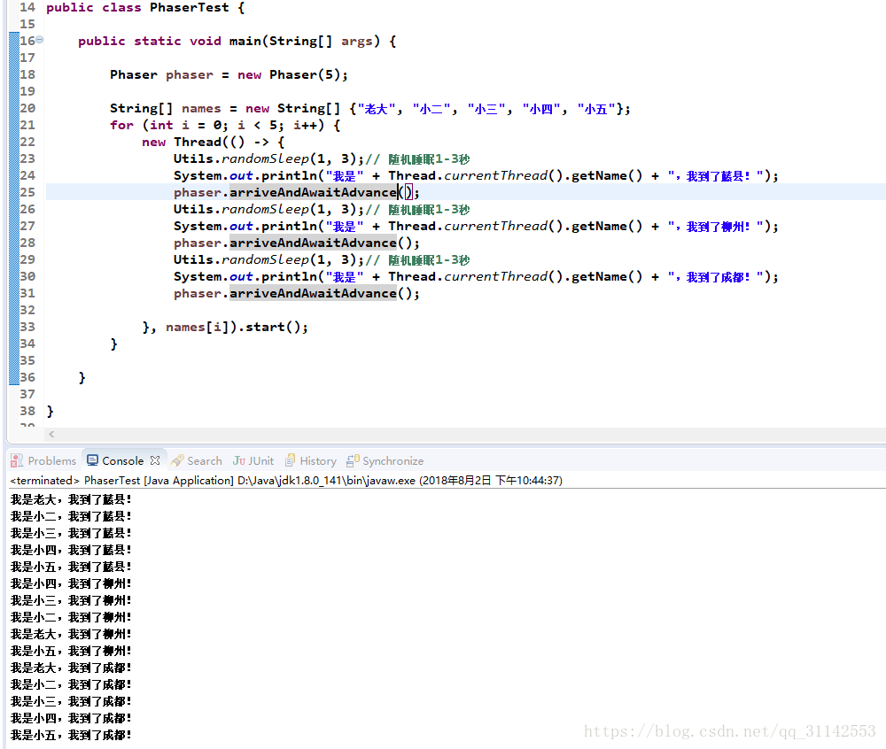
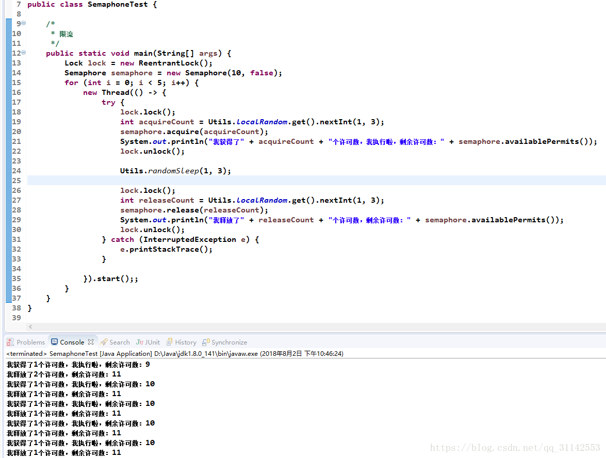

    <a href="#" onclick="refreshContent('multithread')">返回目录</a>

---

# 线程间协同

并发协同原理

## 分析并发协同问题的常用思路

并发的是什么？

在什么地方需要协同？

该谁等待？谁来通知？

什么线程在什么时候需要等待

## 并发协同的实现方式

    多线程协同执行都基于条件等待-通知模式。
    
    方式一：基于传统的Synchronized及Object的wait、notify、notifyAll监视器方法的方式。
    
    方式二：基于Lock及Condition的await、singal方法的等待-通知方式。
    
    方式三：用Java并发包中提供的协同API，来非常方便地实现多线程并发协同

### 一、CountDownLatch倒计数锁存器

用途：协同控制一个或多个线程等待在其它线程中执行的一组操作完成，再继续执行。

用法及原理：

    构造方法CountDownLatch(int count)：count指定等待的条件数（操作数、任务数），不可再更改。
    
    等待方法await()：阻塞等待线程直到条件都满足（count等待条件计数减少到0）。如果count已是0，则不会阻塞，继续执行。
    
    条件完成减计数方法countDown()：每一条件完成时，都调用countDown()来对count计数减一。
    
    boolean await(long timeout, TimeUnit unit）：阻塞等待最长时间。返回true表示等待条件到达；false表示条件未到达，但时间到了。
    
    long getCount()：获取当前计数值。该方法常用于调试或测试。

注意：

    每个CountDownLatch对象，只可使用一次，计数变为0后，就不可再用了。

适用场景：

    1、等待N个条件到达（完成）：new CountDownLatch(N)，等待N个线程完成；等待N个操作完成；等待某操作完成N次。
    
    2、用作开关，让多个等待线程开启继续执行，new CountDownLatch(1)，多个线程await()等待，开关线程countDown()开始。

例：

### 二、CyclicBarrier循环屏障

    用途：协同指定数目的线程，让这些线程在这个屏障前等待，直到所有线程都到达了这个屏障，再一起继续执行。线程继续执行后，这个屏障可再次使用，因此称为循环屏障。

用法及原理：

    构造方法CyclicBarrier(int parties)：parties指定由多少个部分（线程）参与，称为参与数。
    
    构造方法CyclicBarrier(int parties, Runnable barrierAction)：barrierAction所有参与者都到达屏障时执行一次的命令。
    在一组线程中的最后一个线程到达之后（但在释放所有线程之前）在该线程中执行该命令，该命令只在每个屏障点运行一次。若要在继续执行所有参与线程之间更新共享状态，此屏障操作很有用。
    
    等待方法int await() throw InterruptedExection, BrokenBarrierExection：线程执行过程中调用await()方法，表明自己已到达屏障，自己阻塞，等待其他线程到达屏障；
    当所有参与线程都到达屏障，及等待线程释放数=参与数，则释放所有线程，让它们继续执行。
    返回int值，是到达的当前的线程的索引号，注意索引号是从parties-1开始递减到0。BrokenBarrierExection屏障被破环异常，当调用await时，或等待过程中屏障被破坏，则会抛出该异常。
    
    int await(long timeout, TImeUnit unit) throw InterruptedExection, BrokenBarrierExection, TimeoutExection：等待指定时长，如果到了时间还不能释放，则抛出TimeoutExection。
    
    int getNumberWaiting()：获取当前等在屏障处的线程数。
    
    boolean isBroken()：判断屏障是否被破坏。
    
    void reset()：重置屏障为初始状态。如果当前线程正在等待，则这些线程被释放并抛出BrokenBarrierExection。

注意事项：

            一定要确保有足够的参与者线程，否则会一直阻塞在屏障处。
            
            在线程池中使用时一定要小心，确保池的线程数>=要求的参与数。

适用场景：

            1、等待一起出发。
            
            2、多次等待一起出发。

CyclicBarrier和CountDownLatch的区别：

            CountDownLatch：是一部分线程等待另一部分线程来唤醒。
            
            CyclicBarrier：是参与线程彼此等待，都到达了再一起继续。
            
            CountDownLatch不可循环使用，CyclicBarrier可循环使用。

例：

### 三、Phaser阶段协同器

    Java7中增加的一个用于多阶段同步控制的工具类，它包含了CyclicBarrier和CountDownLatch的相关功能，比他们更强大灵活。

    多个线程协同执行的任务分为多个阶段，每个阶段都可以有任意个参与者，线程可以随时注册并参与到某个阶段，当一个阶段中所有任务都成功完成之后，
    Phaser的onAdvance()被调用（可以通过覆盖添加自定义处理逻辑（类似循环屏障使用的Runnable接口）），然后Phaser释放等待线程，自动进入下个阶段。如此循环，直到Phaser不再包含任何参与者。

用法及原理：

构造器

            Phaser()：构造器，参与任务数0。
            
            Phaser(int parties)：构造器，指定初始参与任务数。
            
            Phaser(Phaser parent)：构造器，指定父阶段器，子对象整体作为一个参与者加入到父对象，当子对象中没有参与者时，自动从父对象解除注册。
            
            Phaser(Phaser parent, int parties)：构造器。

增减参与任务数方法

            int register()：增加一个任务数，返回当前阶段号。
            
            int bulkRegister(int parties)：增加指定个数任务数，返回当前阶段号。
            
            int arriveAndDeregister()：减少一个任务数，返回当前阶段号。

到达、等待方法

            int arrive()：到达（任务完成），返回当前阶段号。
            
            int arriveAndAwaitAdvance()：到达后等待其它任务到达，返回当前阶段号。
            
            int awaitAdvance(int phase)：在指定阶段等待（必须是当前阶段才有效）。
            
            int awaitAdvanceInterruptibly(int phase)：
            
            int awaitAdvanceInterruptibly(int phase, long timeout, TimeUnit unit)：

阶段到达出发动作

    protected boolean onAdvance(int phase, int registeredParties)：类似CyclicBarrier的触发命令，通过重写该方法来增加阶段到达动作，该方法返回true将终结Phaser对象。

其它API

    void forceTermination()：强制结束。
    
    int getPhase()：返回当前阶段号
    
    boolean isTerminated()：判断是否结束。

注意事项：

    单个Phaser实例允许的注册任务数上限是65535个，如果任务参与数超过，可以用父子Phaser树的方式。

例：

### 四、Semaphone计数信号量

    Semaphone中维持了一个许可集（实际是许可的数量，没有实际的许可对象），许可的初始数量在构造Semaphone对象由构造参数指定；通过获取、释放信号的方式来控制代码并发执行。
    在线程中通过acquire方法获取一个或多个许可，如能成功获得，则继续执行，同时Semaphone中的许可数量相应减少；
    如不能获得（许可数量不够），则阻塞，等待别的线程通过release方法释放许可，直到能获取到需要的数量方可唤醒。
    
    获得许可，用完后一般通过release方法将许可还原，但不是必须的，根据自己使用的场景决定。
    
    同时，不要求释放许可的线程必须通过调用acquire来获取该许可。可通过应用程序中的编程约定来建立信号量的正确用法。

构造方法

    Semaphone(int parmits)：permits初始许可数，非公平获取
    
    Semaphone(int parmits, boolean fair)：fair=true公平获取，fair=false非公平获取

获取许可方法

    acquire*
    
    tryAcquire

释放许可方法

    release

例：

## 总结：多线程并发协同

等待N个条件到达：CountDownLatch、Phaser

等待一起出发：CountDownLatch、CyclicBarrier、Phaser

不变参与数，多阶段等待一起出发：CyclicBarrier、Phaser

可变参与数，多阶段一起等待出发：Phaser

限制并发数：Semaphone

重点&难点：Phaser

#参考：
- <a href="https://blog.csdn.net/qq_31142553/article/details/81294797" target="_blank">Java多线程并发协同 </a>
- <a href="https://blog.csdn.net/qq_29684305/article/details/85011671 target="_blank">java多线程协同 </a>
